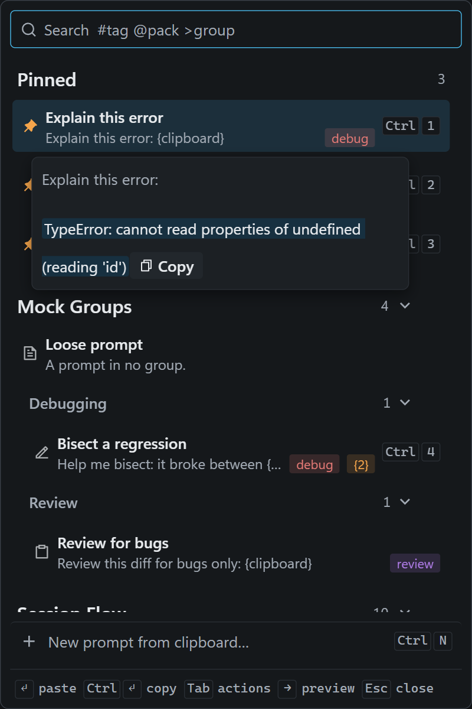

# Promptline

*Your prompt vocabulary, one hotkey away, in every window.*
**[promptline.cc](https://promptline.cc)** · [Download](https://github.com/bekalpaslan/promptline/releases/latest)

A tiny tray app for people who talk to AI all day. Hit the
global hotkey (default `Ctrl+Shift+V`), a popup appears at your cursor with
your prompt library — pick one and it's pasted straight into the app you were
just using: Claude Code or Codex in a terminal, ChatGPT or claude.ai in the
browser, Cursor, a PR
comment box, anywhere.

<p align="center">
  
</p>

## The killer move

Copy an error / stack trace / diff, hit the hotkey, pick **"Root cause first"**
— your template pastes with the clipboard contents already inserted where
`{clipboard}` was. One gesture turns raw error text into a well-formed prompt.

## Install

Windows 10/11 only. Download an installer from the
[Releases page](https://github.com/bekalpaslan/promptline/releases):

- `Promptline_X.Y.Z_x64-setup.exe` — the setup exe (NSIS); smaller, and the
  one to pick if in doubt
- `Promptline_X.Y.Z_x64_en-US.msi` — the MSI, for those who prefer it

Either installs for the current user only, under `%LOCALAPPDATA%\Promptline`,
so there is no admin prompt. If Microsoft Edge WebView2 is missing (it ships
with Windows 11 and most Windows 10 machines), the installer downloads its
bootstrapper, which is the one moment installation needs the network.

The installers are not code-signed yet, so SmartScreen shows "Windows protected
your PC" on first run — choose **More info → Run anyway**. Signing is on the
list; it needs a certificate, not a code change.

After installing, Promptline sits in the tray: left-click the icon for the
manager, press the hotkey anywhere for the popup. There is no auto-update;
a newer release installs over the old one and your prompts, packs and
settings carry over untouched.

### Build from source

Requires Rust and Node 22. `npm run build` produces the same two installers
under `src-tauri/target/release/bundle/` (`nsis/` and `msi/`). See
[Development](#development).

## Uninstall

**Settings → Apps → Installed apps** (Apps & Features), like any other
program. The uninstaller offers a **Delete the application data**
checkbox: leave it off to keep your library for a reinstall, tick it to
remove the data folder too. Either way it removes the autostart entry it
made, so nothing of Promptline runs at the next login.

## Back up / sync

Everything Promptline knows is in one folder,
`%APPDATA%\io.github.bekalpaslan.promptline\` — copy it to back up, restore
it to bring a library back. To share prompts rather than the whole library,
use the pack files: every pack owns a `.json` under `…\packs\` that the app
keeps current, so you can copy one to a colleague, commit it to a project,
or let an agent write into it; the other side imports it from **Settings →
Your library** (see [Data](#data)).

## Known limitations

- **Windows only.** A macOS port needs one module rewritten (see
  [Stack](#stack)); nobody has done it yet.
- **Unsigned installers**, so SmartScreen warns once (above).
- **No auto-update.** Watch the Releases page or the repo.
- **Elevated windows don't accept the paste.** Windows blocks keystrokes
  from a normal process into a window running as administrator (an elevated
  terminal, Regedit, an installer). The popup tells you when that happens;
  the prompt is on your clipboard, so paste it by hand.
- **WebView2 download at install** on the few machines that lack it (above).
- **The default hotkey is taken in two popular places.** `Ctrl+Shift+V` is
  *paste* in Windows Terminal and *paste without formatting* in browsers;
  Promptline wins while it runs, and those apps lose the shortcut. Record
  `Ctrl+Alt+V` in **Settings** instead if you miss either.

Promptline has no network code and no telemetry: it never phones home, and
the only thing that leaves your machine is what you paste. If something
goes wrong it writes `promptline.log` under the data folder; attach it to a bug
report.

## Placeholders

| Token | Expands to |
|---|---|
| `{clipboard}` | whatever was on the clipboard when you hit the hotkey |
| `{date}` / `{time}` | current date / time |
| any other `{lowercase_word}` | a runtime fill-in field — the popup asks before pasting |
| `{{lowercase_word}}` | a config parameter — set its value once (editor → Advanced options), it pastes silently every time |

Unset config parameters downgrade to fill-in fields instead of pasting holes.
Parameter tooling lives behind **Advanced options** in the editor — one card
per kind (built-in / fill-in / config), each with an Edit toggle for removing
them, plus config values. Invisible until you want it.

## The popup

- **Enter** pastes · **Ctrl+Enter / Ctrl+click** copies only · **Esc** closes
- **Ctrl+1..5** pastes the top results instantly — pins (max 5) always sit on
  top, so they become stable muscle-memory slots
- **Tab** opens an action panel: paste / copy / pin / edit in manager / delete
- **→** shows the full-prompt preview card (also on mouse hover)
- Search is fuzzy over titles, tags, and bodies with match highlighting;
  `#tag`, `@pack` and `>group` terms filter (`#debug root cause`); click a tag pill to filter by it
- With no query, prompts sort by how often you use them, grouped under
  collapsible pack sections with a collapsible sub-header per group; searching flattens
  them into one ranked list
- **Ctrl+N** turns whatever you just copied into a new prompt without leaving
  the popup — name pre-filled from the first line, pick its pack, confirm.
  Esc with an edited title asks once before discarding
- Deleting from the action panel offers **Undo**; copy-only confirms, and any
  failure shows in a feedback strip instead of vanishing
- The whole popup is keyboard-operable and screen-reader labelled (a real
  listbox, announced results, collapsible pack sections from the keyboard)
- **Drag the window edge** to resize; the size is remembered
- The prompt stays on your clipboard after pasting — if the app you came from
  had no text field focused, the keystroke lands nowhere, so click into one and
  paste it yourself

## The manager (left-click the tray icon)

- **Autosaves** — no Save button, no lost drafts; Quit from the tray waits for
  a pending save. Deletes are two-click, and **Undo** covers a deleted prompt,
  a deleted pack (the pack comes back, not just its prompts), an ungroup, a
  regroup, and a merge
- Sidebar groups by **pack** (collapsible); each pack and group header has a
  menu button on hover (right-click works too) to rename / lock / export
  (to the clipboard or a file) / delete it; right-click prompts for multi-select actions (move to pack or
  group, add tag, pin/unpin, export, delete) — Ctrl/Shift+click to select
  several. Inline renames commit on Enter only
- **Groups** sit inside a pack: one pack per project, a group per practice
  (debugging, review, docs…). Right-click a pack header → **New group** to
  start one with a fresh prompt; set a prompt's group in the editor or from
  the right-click menu; dragging a prompt into another group moves it there.
  Right-click a group header (or use its ⋯) to start a new prompt in it,
  rename it, ungroup its prompts, or delete the group — deleting removes its prompts after a confirmation dialog
- **Locked packs** (🔒) refuse new prompts and can't be deleted, nor can their
  groups, until unlocked
- **New** above the list makes a pack, a group or a prompt, and always asks
  where: a group picks its pack, a prompt picks a pack or a group in one.
  A new pack or group is selected with its name ready to type. **Generate pack
  with AI** (also under New) takes a topic, hands you an instruction to paste into any AI chat,
  and imports its reply — every prompt is reviewed in a checklist (bulk
  select, per-row pack names, a prompt hiding invisible or direction-changing
  characters flagged and unticked, and malformed JSON is editable in place)
  before anything is added. With a coding agent, leave the topic empty and it surveys
  the project it runs in, writing one pack per daily practice; the dialog
  watches for the agent's file with an elapsed clock and a Stop button, and
  no pack exists until you import
- Sort by uses, title, or **Custom** — press and hold a row to lift it, then
  drag to arrange your own order; **Alt+Up / Alt+Down** moves the selected row
  from the keyboard
- Clicking a pack or group header folds or unfolds it and shows its prompts
  in the pane
- Packs are listed A–Z until you arrange them: **Move up / Move down** in a
  pack's ⋯ menu (or **Alt+Up / Alt+Down** on its header). The popup lists
  packs in the same order. Groups move within their pack the same way
- Every control is reachable from the keyboard, including context menus, and
  labelled for screen readers
- **Settings** (⚙, top-right of the pane): record a hotkey by pressing it,
  then **Apply** it; autostart (a login launch stays in the tray; the
  manager opens from the tray icon); theme (System / Light / Dark, System
  follows Windows); popup density; UI font (Outfit / system / serif / mono); UI
  scale (90–125%); and **Your library** — export the whole library to the
  clipboard or a file, import from the clipboard or a file, or **Open folder** to see the data folder
  (library, packs and the log file) in Explorer, plus per-pack rows to
  import from, export, or create that pack's file; and **About**, with the
  version you're running

## Data

Everything lives in `%APPDATA%\io.github.bekalpaslan.promptline\` as plain JSON — snippets,
packs, and preferences. Pack format docs: [`packs/TEMPLATE.md`](packs/TEMPLATE.md);
curated packs ship in [`packs/`](packs/). Older data formats migrate automatically,
and a library from a release before 0.2.9 (which kept it under
`%APPDATA%\com.promptline.app\`) is moved to the new folder on first start.

Every pack owns a file under `…\packs\` from the moment it exists — however it
came about, including packs conjured by an import — and the app keeps it
current, so it's always there to share, back up, or let an agent write into.
Deleting a pack moves its file to `…\packs\deleted\` rather than unlinking it:
the file may hold prompts written there but never imported, and deleting a pack
in the app shouldn't be able to destroy them.

## Development

Requires Rust and Node 22 (`.nvmrc`).

```sh
npm install
npm run dev        # run in dev mode (starts Vite + Tauri; UI hot-reloads)
npm run build      # produce installer (src-tauri/target/release/bundle)
npm run ui:build   # typecheck + build the frontend only
npm test           # JS core tests (node --test)
npm run tokens     # render design/tokens.json into src/index.css (tokens:check verifies)
                   # edited tokens on the design-system page? ask Claude to pull
                   # its project/tokens.json into design/tokens.json, then run this
npm run design:build  # bundle the real components + previews for the design-system artifact (design/dist)
npm run test:rust  # Rust unit tests (cargo test)
npm run lint       # ESLint over the whole tree (`npx eslint src` for the app alone)
```

CI (`.github/workflows/ci.yml`) runs lint, typecheck, the frontend build,
`cargo fmt`/`clippy` and both test suites on every push and pull request; a
`v*` tag also builds both installers and keeps them as workflow artefacts
(the release itself is still made by hand). See [Install](#install) for the
unsigned-installer caveat.

The frontend is a two-entry Vite app (`index.html` → manager window,
`popup.html` → popup window) under `src/`. Shared pure logic lives in
`ui/core.js` (UMD; bridged into React via `src/lib/core.ts`, covered by tests).

[`BEHAVIOR.md`](BEHAVIOR.md) covers what each surface does and why the
non-obvious parts are built the way they are — start there before changing
the paste pipeline or anything touching pack files.
[`CONTRIBUTING.md`](CONTRIBUTING.md) has the checks and conventions;
[`SECURITY.md`](SECURITY.md) says what the app touches and how to report a
problem.

## Stack

Tauri 2 (Rust) + React 19 + Vite + Tailwind v4 + [shadcn/ui](https://ui.shadcn.com)
(Base UI primitives, Outfit font, Remix Icon). Windows-specific parts (focus
restore via `SetForegroundWindow`, paste via `SendInput`) are isolated in the
`src-tauri/src/platform.rs`; a macOS port only needs that file
reimplemented (CGEventPost + Accessibility permission).

## Credits

- [Outfit](https://github.com/Outfitio/Outfit-Fonts), the UI font, by the
  Outfit Project Authors under the SIL Open Font License 1.1
- [Remix Icon](https://remixicon.com), the icons, by Remix Design under the
  Remix Icon License 1.0
- [Tauri](https://tauri.app), the shell that turns a Rust core and a webview
  into a Windows app
- [shadcn/ui](https://ui.shadcn.com) on [Base UI](https://base-ui.com), the
  components

The full licence texts and the rest of the bundled dependencies are in
[`THIRD-PARTY-NOTICES.md`](THIRD-PARTY-NOTICES.md), which also ships with
the installer.

## License

MIT — see [`LICENSE`](LICENSE).
